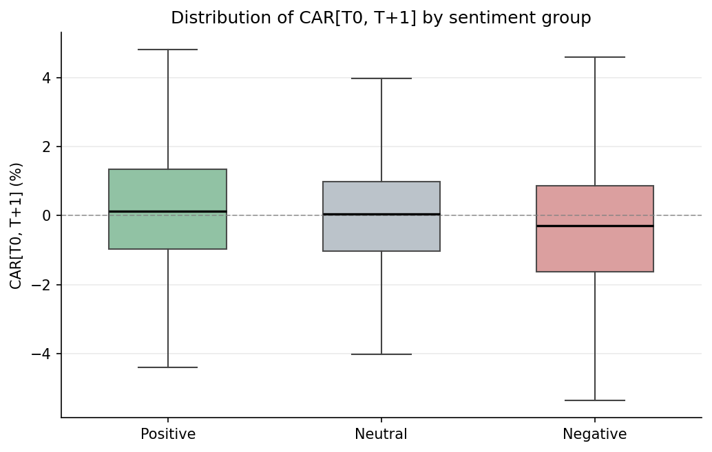

# LLM Sentiment Analysis of Brazilian Financial News (B3)

Zero-shot sentiment classification of **10,108 Portuguese-language financial headlines** using **Llama 3.1 8B Instruct**, tested against short-term stock returns on the Brazilian exchange (B3) across **four complementary layers of statistical evidence**.

This project is the empirical core of my undergraduate economics thesis (UFV, 2026). It asks whether the sentiment an open-source LLM extracts from financial news headlines carries statistically detectable information about the returns of the underlying stocks — a question studied mostly for U.S. English-language markets and rarely for Portuguese.

---

## Key results

| Layer | Method | Result |
|-------|--------|--------|
| 1. Event study | Market Model, CAR[T0, T+1] | Positive news **+0.19%**, negative news **−0.61%** (both *p* < 0.001) |
| 2. Directional accuracy | McNemar's test | **54.74%** vs. 51.64% fair baseline (*p* = 0.0021) |
| 3. Logistic regression | Firm fixed effects, date-clustered SE | Sentiment odds ratio **1.20** (*p* < 0.001) |
| 4. Portfolio backtest | Long/short, annualized Sharpe | **3.80** vs. 0.37 (Ibovespa) and 0.82 (equal-weighted basket) |

The four layers converge on the same conclusion: the sentiment signal is **statistically detectable but economically modest**. A notable asymmetry emerges — the negative-news effect (−0.61%) is roughly **3.3× larger** in magnitude than the positive-news effect (+0.19%), consistent with the loss-aversion literature.

The Sharpe ratio of 3.80 should be read with care: the backtest excludes transaction costs and short-borrow costs, and cross-sectional diversification mechanically deflates portfolio variance. It is evidence that the signal carries economically relevant content in a frictionless setting — not an estimate of realizable risk-adjusted return.



*Distribution of CAR[T0, T+1] across the three sentiment groups. Median near zero in all three, but the NEGATIVE box is shifted downward and has the widest dispersion.*

---

## Data

- **10,798** raw headlines scraped from Google News (2023–2024) for 10 of the largest B3 companies, via boolean `intitle:` search across company-specific keywords.
- **10,108** headlines successfully classified (690 dropped due to API formatting failures, 6.4%, distributed evenly across firms and dates).
- Sample spans oil & gas (Petrobras), banking (Bradesco, Banco do Brasil, Itaú, BTG Pactual, Itaúsa), consumer goods (Ambev), utilities (Eletrobras), mining (Vale), and industrials (WEG).

Prices (adjusted close) come from Yahoo Finance via `yfinance`; the risk-free proxy is the Brazilian SELIC/CDI rate from the Central Bank of Brazil SGS API. See [`data/README.md`](data/README.md) for the column dictionary.

---

## Methodology

The event window is two days — the event date T0 and the following trading day T+1. Expected returns are estimated with a single-factor **Market Model** over a [−120, −31] trading-day estimation window (minimum 30 observations), using the Ibovespa as the market proxy:

```
R_i,t − R_f,t = α_i + β_i (R_m,t − R_f,t) + ε_i,t
```

Abnormal returns are the difference between observed and expected returns; CAR sums the abnormal returns across T0 and T+1. The four analysis layers:

1. **Event study** — one-sample *t*-tests of mean CAR per sentiment group against zero, plus a one-sided test comparing positive vs. negative groups.
2. **Directional accuracy** — binary reformulation (excluding neutral), McNemar's test against a majority-class baseline, and a confusion matrix.
3. **Logistic regression** — `P(CAR > 0)` on sentiment with firm fixed effects; standard errors clustered by publication date (chosen over firm clustering because only 10 firms fall short of the asymptotic requirement, while ~500 dates satisfy it).
4. **Long/short backtest** — dollar-neutral daily portfolio built from the day's aggregate sentiment signal, evaluated with an annualized Sharpe ratio and Lo (2002) standard error, against two benchmarks.

Classification uses **prompt engineering** (not fine-tuning): the model is given an analyst persona and asked to return a JSON array of labels, with `temperature=0` for determinism, in batches of 15 headlines. Inference runs through the Groq API, which hosts the publicly released Meta weights — the experiment stays fully open-source.

---

## Tech stack

**Python** · pandas · NumPy · statsmodels · scipy · yfinance · matplotlib · OpenAI client (async) · pygooglenews · **Groq API (Llama 3.1 8B Instruct)**

---

## Reproduce

```bash
pip install -r requirements.txt
```

1. Set your Groq API key as an environment variable: `export GROQ_API_KEY=your_key_here`
2. Run the notebook in `notebooks/` in order — scraping → sentiment classification → event study → logistic regression & portfolio.

> **Note:** the sentiment labels and abnormal returns are already provided in [`data/event_study_results.csv`](data/event_study_results.csv), so the statistical analysis can be reproduced without re-running the scraping or the LLM classification.

---

## Repository structure

```
llm-sentiment-b3/
├── README.md
├── requirements.txt
├── LICENSE
├── notebooks/
│   └── pipeline_completo.ipynb        # scraping → LLM → event study → logit → backtest
├── data/
│   ├── event_study_results.csv        # derived base: sentiment label + AR + CAR per event
│   ├── dataset_10_gigantes_tcc.csv    # raw scraped headlines
│   └── README.md                      # column dictionary
├── figures/
│   └── car_boxplot.png
└── docs/
    ├── TCC_sentiment_analysis_b3.pdf  # full thesis (Portuguese)
    └── thesis_english.pdf             # full thesis (English translation)
```

---

## Full thesis

The complete methodology, literature review, and results discussion are in [`docs/`](docs/) — in the original Portuguese and in English translation.

## Author

Arthur Bastos Machado de Oliveira — B.Sc. in Economics, Universidade Federal de Viçosa (2026).

## License

MIT — see [`LICENSE`](LICENSE).
